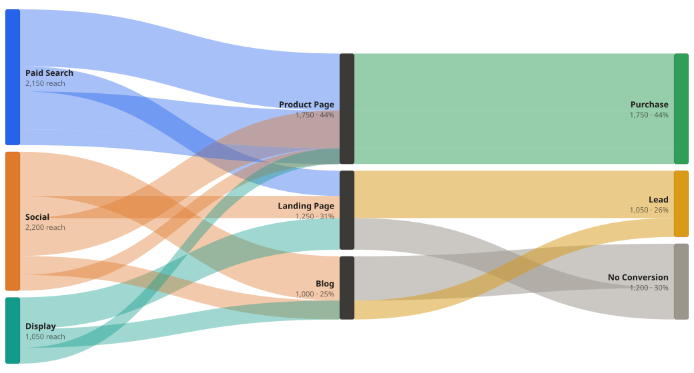

# AttriChart

A Sankey-style flow chart for journeys with overlapping membership. Built for multi-touch marketing attribution, generalized for any staged flow where one stage allows a record to belong to several nodes at once.

[Live demo](https://rwcjr.github.io/attrichart/) · [@attrichart/core](https://www.npmjs.com/package/@attrichart/core) · [@attrichart/vue](https://www.npmjs.com/package/@attrichart/vue)



## Why this exists

A Sankey diagram conserves flow: every unit follows exactly one path, and each column partitions cleanly to 100%. Multi-touch attribution breaks that. A user exposed to both Paid Search and Social cannot be one conserved path, so standard Sankey libraries force a choice: double-count the user, split them into fractions, or flatten to single-touch attribution and lose the truth.

AttriChart treats the overlap explicitly:

- The overlap-enabled stage (campaigns, for example) renders **reach**. Its segments are allowed to sum past 100% because a shared record appears in every node that contains it.
- Shared attribution is drawn as overlap. A record in several source nodes is drawn from each of them, and where those translucent ribbons stack they darken. The darkening is the shared attribution, made visible.
- Downstream stages consolidate to **true unique counts** and stay clean 100% partitions, so widths there map to real users, not inflated touch counts.

The engine supports any number of stages and overlap on any stage. Rendering is plain SVG with zero runtime dependencies.

## Install

```sh
npm install @attrichart/core
# Vue 3 apps
npm install @attrichart/vue
```

## Quick start

```html
<div id="chart"></div>
```

```js
import { AttriChart } from '@attrichart/core';

const chart = new AttriChart(document.querySelector('#chart'), {
  stages: [
    {
      id: 'campaign',
      label: 'Campaigns',
      overlap: true, // records may belong to several campaigns
      nodes: [
        { id: 'search', label: 'Paid Search', color: '#2563eb' },
        { id: 'social', label: 'Social', color: '#e07a2b' },
      ],
    },
    {
      id: 'conversion',
      label: 'Conversion',
      nodes: [
        { id: 'purchase', label: 'Purchase', color: '#2f9e57' },
        { id: 'none', label: 'No Conversion', color: '#9b958c' },
      ],
    },
  ],
  records: [
    // each record is a cohort: everyone in it shares the same path
    { value: 500, membership: { campaign: ['search'], conversion: 'purchase' } },
    { value: 300, membership: { campaign: ['social'], conversion: 'none' } },
    // 200 users touched by BOTH campaigns: drawn from both, darker where they overlap
    { value: 200, membership: { campaign: ['search', 'social'], conversion: 'purchase' } },
  ],
});

chart.render();
```

The chart fills its container and re-lays out on resize. Call `chart.update(data, options)` to change anything in place and `chart.destroy()` to tear it down.

## Data model

```ts
interface AttriChartData {
  stages: StageDefinition[]; // ordered left to right, at least two
  records: FlowRecord[];
}

interface StageDefinition {
  id: string;
  label?: string;
  overlap?: boolean; // default false
  nodes: { id: string; label?: string; color?: string }[];
}

interface FlowRecord {
  id?: string; // optional, surfaced in events and tooltips
  value: number; // cohort size, > 0
  membership: Record<string, string | string[]>;
  // stageId -> nodeId on standard stages
  // stageId -> nodeId[] on overlap stages
}
```

Validation is strict and errors say exactly what to fix: unknown node ids, multi-membership on a non-overlap stage, missing stages, and so on.

## Attribution modes

| Mode              | Behavior                                                                                                                                                                  |
| ----------------- | ------------------------------------------------------------------------------------------------------------------------------------------------------------------------- |
| `reach` (default) | Shared records carry full width into every node that contains them. Overlap-stage segments sum past 100%. Stacked translucent ribbons darken where attribution is shared. |
| `fractional`      | Shared records split their width evenly across their nodes. Every column stays strictly additive. Tidier arithmetic, no overlap darkening.                                |

```js
new AttriChart(el, data, { attributionMode: 'fractional' });
```

## Options

All options are optional. Defaults shown.

```js
{
  width: 'auto',            // number | 'auto'; auto fills the container and observes resize
  height: 'auto',           // number | 'auto'; auto derives from width at a 0.54 aspect ratio
  attributionMode: 'reach', // 'reach' | 'fractional'
  nodeWidth: 22,            // px width of node bars
  nodeGap: 10,              // px vertical gap between nodes in a column
  padding: { top: 14, right: 8, bottom: 14, left: 8 },

  colors: {
    palette: [...],         // cycled per stage for nodes without an explicit color
    node: (node, stage) => '#hex', // hook; node.color wins over it
    ribbon: undefined,      // 'source' | 'target' | (info) => '#hex'
                            // default: 'source' leaving an overlap stage, else 'target'
  },
  ribbonOpacity: 0.4,       // base opacity of overlap-stage ribbons

  font: {
    family: 'inherit',      // inherits the surrounding theme by default
    size: 12.5,
    color: 'currentColor',
    mutedColor: '',         // sublabel color; defaults to color at reduced opacity
  },

  labels: {
    show: true,
    values: true,           // counts under node labels
    percent: true,          // percent of the unique total on standard stages
    format: (v) => v.toLocaleString(),
  },

  tooltip: {
    enabled: true,
    template: (info) => '<b>html</b>', // info.kind is 'node' or 'ribbon'
  },

  hover: {
    isolatePath: true,      // hovering a ribbon isolates its record's full path
    dimOpacity: 0.06,
  },

  a11y: {
    label: 'Attribution flow chart', // SVG aria-label
    respectReducedMotion: true,      // disables transitions under prefers-reduced-motion
  },
}
```

## Events

```js
chart
  .on('nodeClick', (node) => {}) // { stage, node, value, isReach, percent, records }
  .on('ribbonClick', (ribbon) => {}) // { record, sourceNode, targetNode, value, ... }
  .on('hover', (info) => {}) // { kind: 'node' | 'ribbon', ... }
  .on('leave', () => {});
```

## Vue 3

```vue
<script setup>
import { AttriChart } from '@attrichart/vue';
</script>

<template>
  <AttriChart :data="data" :options="options" @node-click="onNodeClick" />
</template>
```

Vue is a peer dependency. The component does no DOM work until mounted, so it imports cleanly under SSR and Nuxt.

## Using with Vuetify

`@attrichart/vue` does not depend on Vuetify, but it is built to sit inside a Vuetify 3 app as if it were native. Add the `vuetify-theme` prop and the chart reads the active theme's CSS custom properties, then re-renders when the app switches between light and dark:

```vue
<v-card class="pa-6">
  <AttriChart :data="data" vuetify-theme />
</v-card>
```

The theme-token mapping:

| Vuetify token                                                                                               | Used for                    |
| ----------------------------------------------------------------------------------------------------------- | --------------------------- |
| `--v-theme-primary` through `--v-theme-error` (primary, secondary, tertiary, info, success, warning, error) | Node palette, in that order |
| `--v-theme-on-surface`                                                                                      | Label color                 |
| `--v-theme-on-surface` at 62% opacity                                                                       | Sublabel color              |

Notes:

- Theme-derived colors only fill option slots you left unset. An explicit `options.colors.palette` or node-level `color` always wins, and the `theme` prop (`{ palette, textColor, mutedColor }`) wins over `vuetify-theme`.
- Typography is inherited. The chart's `font.family` defaults to `inherit`, so Vuetify's type scale applies. Override it through `options.font.family` if needed.
- The chart fills its parent through a ResizeObserver, so it behaves inside `v-card`, `v-container`, and the `v-row`/`v-col` grid with no fixed-width assumptions.
- Style isolation: the chart emits no global selectors or stylesheets. Everything is inline on its own elements, including the tooltip, so nothing collides with Vuetify and nothing leaks out.

A runnable example lives in [`examples/vue-vuetify`](examples/vue-vuetify), with a chart in a `v-card` and a light/dark toggle.

## Examples

- [`examples/demo.html`](examples/demo.html): three charts on one page covering reach mode, fractional mode, and a four-stage journey with overlap on a middle stage
- [`examples/vanilla/index.html`](examples/vanilla/index.html): smallest possible usage
- [`examples/vue-vuetify`](examples/vue-vuetify): Vuetify 3 integration

Build first (`pnpm install && pnpm build`), then open the HTML files directly or run the Vue example with `pnpm --filter attrichart-example-vue-vuetify dev`.

## Browser support

Modern evergreen browsers. The library targets ES2020 and uses SVG, ResizeObserver, and matchMedia. No IE11.

## Contributing

See [CONTRIBUTING.md](CONTRIBUTING.md). Issues and pull requests are welcome, including for the planned React wrapper.

## License

[MIT](LICENSE)
